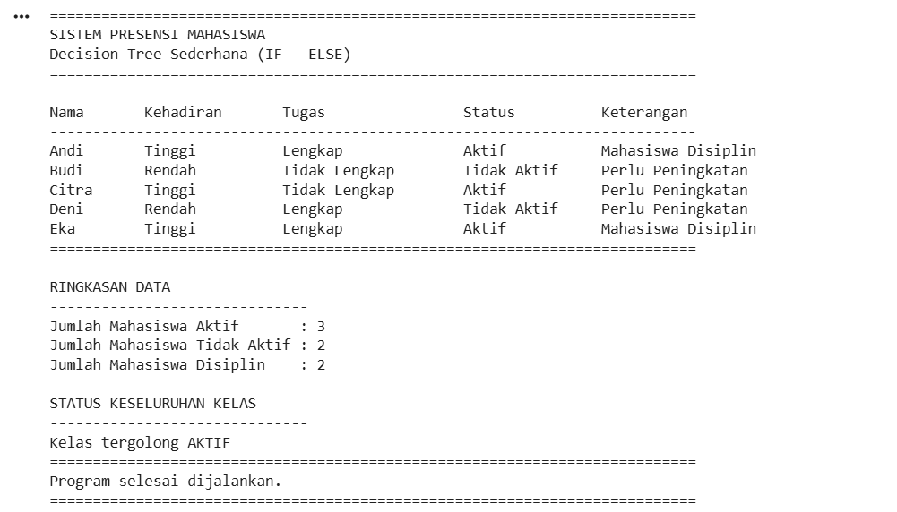

# tugasweek7-kecerdasankomputasional

PROGRAM DECISION TREE SEDERHANA
PRESENSI MAHASISWA

Data mahasiswa
mahasiswa = [
    {"nama": "Andi", "kehadiran": "Tinggi", "tugas": "Lengkap"},
    {"nama": "Budi", "kehadiran": "Rendah", "tugas": "Tidak Lengkap"},
    {"nama": "Citra", "kehadiran": "Tinggi", "tugas": "Tidak Lengkap"},
    {"nama": "Deni", "kehadiran": "Rendah", "tugas": "Lengkap"},

    # Data mahasiswa baru
    {"nama": "Eka", "kehadiran": "Tinggi", "tugas": "Lengkap"}
]

print("=" * 75)
print("SISTEM PRESENSI MAHASISWA")
print("Decision Tree Sederhana (IF - ELSE)")
print("=" * 75)

FITUR TAMBAHAN

jumlah_aktif = 0
jumlah_tidak_aktif = 0
mahasiswa_disiplin = 0

Header tabel
print("\n{:<10} {:<15} {:<20} {:<15} {:<25}".format(
    "Nama", "Kehadiran", "Tugas", "Status", "Keterangan"
))

print("-" * 75)

PROSES DATA

for data in mahasiswa:

    nama = data["nama"]
    kehadiran = data["kehadiran"]
    tugas = data["tugas"]

    # Decision Tree sederhana
    if kehadiran == "Tinggi":
        status = "Aktif"
        jumlah_aktif += 1
    else:
        status = "Tidak Aktif"
        jumlah_tidak_aktif += 1

    # Pengecekan tambahan
    if kehadiran == "Tinggi" and tugas == "Lengkap":
        keterangan = "Mahasiswa Disiplin"
        mahasiswa_disiplin += 1
    else:
        keterangan = "Perlu Peningkatan"

    # Menampilkan data dalam bentuk tabel
    print("{:<10} {:<15} {:<20} {:<15} {:<25}".format(
        nama,
        kehadiran,
        tugas,
        status,
        keterangan
    ))

print("=" * 75)

FITUR TAMBAHAN

print("\nRINGKASAN DATA")
print("-" * 30)
print("Jumlah Mahasiswa Aktif       :", jumlah_aktif)
print("Jumlah Mahasiswa Tidak Aktif :", jumlah_tidak_aktif)
print("Jumlah Mahasiswa Disiplin    :", mahasiswa_disiplin)

FITUR MENU TAMBAHAN

print("\nSTATUS KESELURUHAN KELAS")
print("-" * 30)

if jumlah_aktif > jumlah_tidak_aktif:
    print("Kelas tergolong AKTIF")
else:
    print("Kelas tergolong KURANG AKTIF")

print("=" * 75)
print("Program selesai dijalankan.")
print("=" * 75)

Hasil Outputnya

